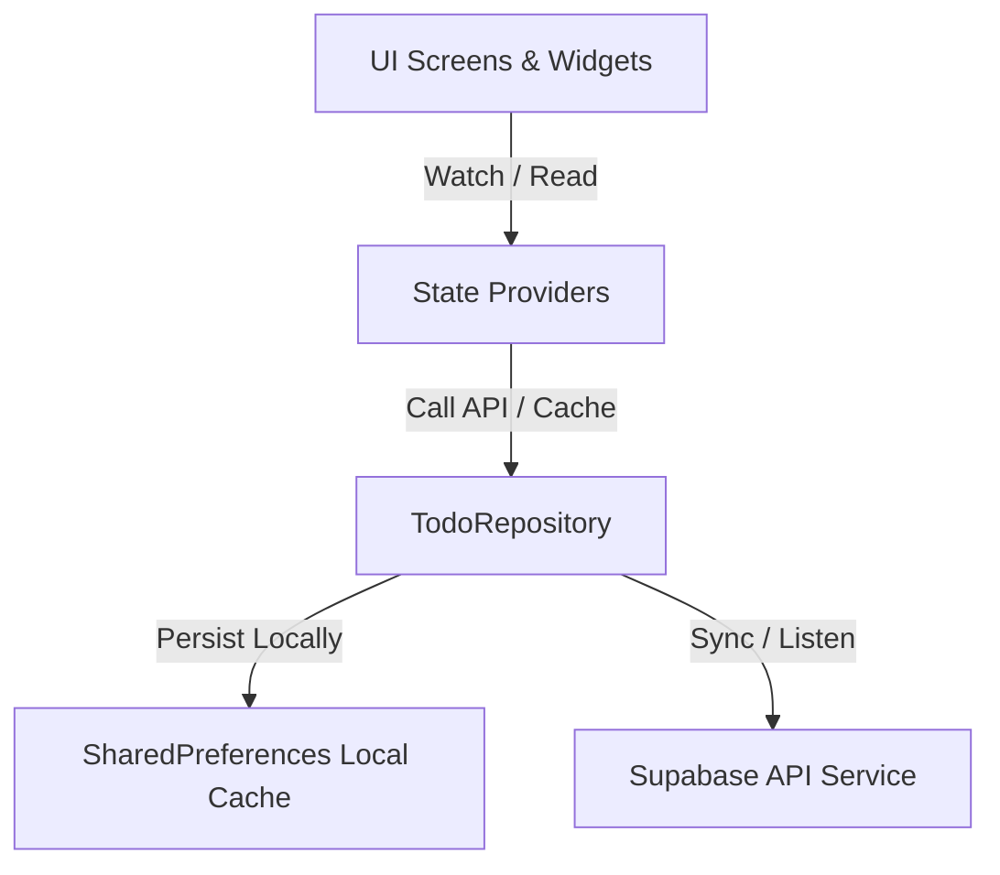

# Offline-First Sync-Enabled Todo Application

A premium, production-ready Todo Management Application built using Flutter, Riverpod state management, local cache persistence, and real-time Supabase cloud synchronization.

---

## 1. Product Architecture & Specifications

This application implements a robust, maintainable architecture modeled after modern industry standards, separating responsibilities into modular layers:



### 1.1. Directory Structure

The workspace follows the **Clean Separation of Concerns** design pattern:

```text
lib/
├── core/
│   └── theme/           # AppTheme configuration (colors, styles, buttons)
├── models/
│   ├── todo.dart        # Todo item model (id, title, priority, category, dueDate)
│   └── sync_queue.dart  # SyncCommand models for chronological operations queue
├── repositories/
│   ├── auth_repository.dart  # User authentication states and registration/login logic
│   └── todo_repository.dart  # Offline-first caching, queuing, and sync replay engine
├── screens/
│   ├── auth/            # Authentication Screen (login, register, reset, guest flow)
│   └── todos/           # Dashboard Screen (workspace grids, header statuses, summary cards)
├── services/
│   └── supabase_service.dart # Real and Mock Supabase integration client layer
├── state/
│   └── todo_providers.dart   # Riverpod dependency injection definitions
└── widgets/
    ├── empty_state.dart      # Custom double-ring glowing empty state placeholder
    ├── error_state.dart      # Warnings card displaying developer logs and retry actions
    ├── todo_card.dart        # Responsive todo card supporting scale-up hover animations
    └── todo_card_skeleton.dart # Shimmering loading placeholder grid cards
```

---

## 2. Synchronization & Replication Mechanics

The repository implements an **Offline-First Synchronization Engine** with a local replay queue:

* **Optimistic UI Updates:** Modifications (insertions, updates, deletions) are applied instantly to local state and cached to storage, keeping interactions responsive regardless of network latency.
* **Persistent Replication Queue:** Actions completed while offline are stored chronologically in a local sync queue.
* **Queue Replay Engine:** When toggled back online, the app replays operations sequentially, merging results with the server database.
* **Conflict Resolution:** Employs **Last-Write-Wins (LWW)** resolution, resolving data conflicts by comparing the `updatedAt` timestamps.
* **Data Tenancy Isolation:** Isolates cached values and database writes by pinning queries securely to the authenticated user ID.

---

## 3. Git Source Control Policies

We implement professional version control and Git branching strategies to ensure clean release histories:

* **Main Branch:** `master` represents the stable production-ready state.
* **Development Flow:** Feature branches (e.g. `feature/ui-states`) are merged into `master` via approved Pull Requests.
* **Release Branches:** Stable release builds are cataloged under `release/v1.0.0` conventions.
* **Semantic Commit Conventions:**
  * `feat:` for new capabilities (e.g., `feat: implement pulsing shimmer skeletons`).
  * `fix:` for code repairs (e.g., `fix: clamp empty state opacity boundaries`).
  * `docs:` for documentation updates (e.g., `docs: write release procedure`).
  * `test:` for test suite creations (e.g., `test: add widget verification suite`).

---

## 4. Run & Verification Guide

### 4.1. Run Locally
To spin up a local development web server:
```bash
flutter run -d chrome
```

### 4.2. Run Tests
To execute the complete unit and widget test suite (11 passing tests):
```bash
flutter test
```
