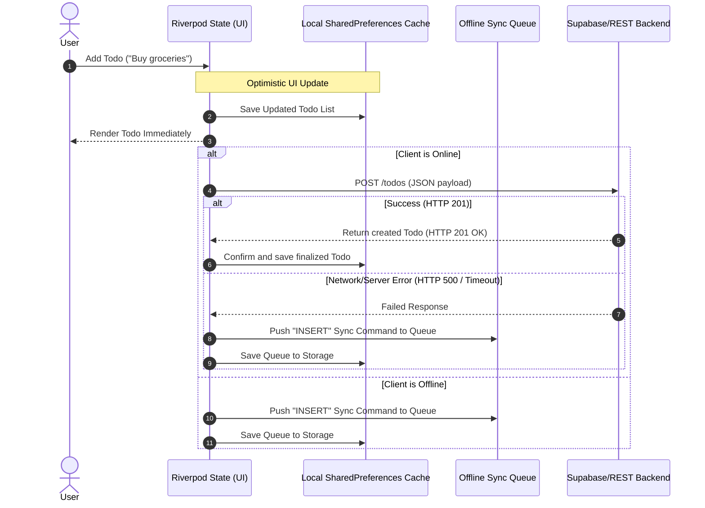

# API Contract and Request/Response Lifecycle

This document serves as the official **API Contract** for the Todo Management Application. It defines the communication standards between the frontend client (Flutter) and the backend REST API/Supabase database.

---

## 1. Core Concepts & Standards

### HTTP (Hypertext Transfer Protocol)
HTTP is the standard application-layer protocol used for transmitting hypermedia documents. It functions as a request-response protocol in the client-server model:
* **Client-initiated:** The client (mobile/web app) sends an HTTP request message containing a request line, headers, and an optional body.
* **Server-response:** The server processes the request and responds with a status code, headers, and an optional body.
* **Statelessness:** Each request is independent. Authorization credentials (e.g. JWT tokens) must be passed with every request that requires authentication.

### REST (Representational State Transfer)
REST is an architectural style for designing networked applications. It defines constraints to create scalable, performant, and reliable APIs:
* **Resource-Oriented:** Everything is considered a "resource" identified by a unique URL (e.g., `/todos`).
* **Standard Methods:** Utilizes HTTP verbs (`GET`, `POST`, `PUT`, `PATCH`, `DELETE`) to express actions.
* **Stateless Communication:** The server does not store client session states.

### JSON (JavaScript Object Notation)
All request payloads and response bodies use JSON format. 
* **Header Requirement:** All modifying requests must include the header `Content-Type: application/json`.
* **Standard Payload Schema:** Data is exchanged as structured key-value pairs (using strings, numbers, booleans, arrays, objects, and null values).

---

## 2. Todo Data Schema

Both frontend serialization ([Todo.toJson](file:///c:/Users/iniya/todo_app/lib/models/todo.dart#L61)) and the PostgreSQL database schema ([database_schema.sql](file:///c:/Users/iniya/todo_app/database_schema.sql#L5)) adhere to this JSON format:

```json
{
  "id": "string (UUID or unique text, primary key)",
  "user_id": "string (UUID, foreign key, nullable)",
  "title": "string (required, non-empty)",
  "description": "string (optional, nullable)",
  "completed": "boolean (default: false)",
  "priority": "string ('high' | 'medium' | 'low', default: 'medium')",
  "category": "string (default: 'General')",
  "due_date": "string (ISO 8601 datetime format, nullable)",
  "created_at": "string (ISO 8601 datetime format)",
  "updated_at": "string (ISO 8601 datetime format)"
}
```

---

## 3. API Endpoints

### 3.1. Todos Resource (`/todos`)

#### `GET /todos`
Retrieves a list of all Todos associated with the authenticated user.
* **Authentication:** Required (Bearer JWT or Supabase Session)
* **Response Status:** `200 OK`
* **Response Body:** `Array of Todo objects`

#### `POST /todos`
Creates a new Todo item.
* **Authentication:** Required
* **Request Headers:** `Content-Type: application/json`
* **Request Body:** `Todo object` (typically excluding `user_id` which is populated by the server)
* **Response Status:** `201 Created` or `200 OK`
* **Response Body:** `Todo object` (complete with server-populated fields like `user_id`, `created_at`, `updated_at`)

#### `PUT /todos/{id}`
Performs a full replacement update of the Todo with the specified `{id}`.
* **Authentication:** Required
* **Request Headers:** `Content-Type: application/json`
* **Request Body:** Full `Todo object`
* **Response Status:** `200 OK`
* **Response Body:** Updated `Todo object`

#### `PATCH /todos/{id}`
Applies partial updates to a Todo (e.g., toggling completion status).
* **Authentication:** Required
* **Request Headers:** `Content-Type: application/json`
* **Request Body:** JSON containing only the fields to be updated, e.g.:
  ```json
  { "completed": true }
  ```
* **Response Status:** `200 OK`
* **Response Body:** Updated `Todo object`

#### `DELETE /todos/{id}`
Deletes the Todo with the specified `{id}`.
* **Authentication:** Required
* **Response Status:** `204 No Content` or `200 OK`
* **Response Body:** None

---

### 3.2. Authentication Resources (`/auth`)

These represent the GoTrue endpoint bindings managed by the authentication client ([AuthRepository](file:///c:/Users/iniya/todo_app/lib/repositories/auth_repository.dart)):

#### `POST /auth/signup`
Registers a new user account.
* **Request Body:**
  ```json
  { "email": "user@example.com", "password": "password123" }
  ```
* **Response Status:** `200 OK` or `201 Created`
* **Response Body:**
  ```json
  { "user_id": "uuid-string-here", "email": "user@example.com" }
  ```

#### `POST /auth/login`
Authenticates a user and starts a session.
* **Request Body:**
  ```json
  { "email": "user@example.com", "password": "password123" }
  ```
* **Response Status:** `200 OK`
* **Response Body:**
  ```json
  { "access_token": "jwt-token-string", "user_id": "uuid-string-here" }
  ```

#### `POST /auth/logout`
Terminates the user's active session.
* **Response Status:** `204 No Content` or `200 OK`

---

## 4. HTTP Status Codes & Error Handling

The API contract establishes the following HTTP status codes to communicate result states:

| Code | Reason Phrase | Description / Application Context |
|---|---|---|
| **`200`** | `OK` | Standard success response for `GET`, `PUT`, `PATCH`, and `POST`. |
| **`201`** | `Created` | Success response for `POST` when a new resource is successfully created. |
| **`204`** | `No Content` | Success response for `DELETE` or `POST /auth/logout` when no content is returned. |
| **`400`** | `Bad Request` | The request was malformed (e.g. invalid JSON, missing required fields). |
| **`401`** | `Unauthorized` | Missing or invalid auth credentials/token. |
| **`403`** | `Forbidden` | Authenticated but access is denied (e.g., Row-Level Security policy block). |
| **`404`** | `Not Found` | The requested Todo item or route does not exist. |
| **`409`** | `Conflict` | State conflict (e.g., attempting to create a Todo with an ID that already exists). |
| **`500`** | `Internal Server Error` | Backend server error occurred. |

### Error Response Body Format
When a status code `>= 400` is returned, the response body contains a JSON object describing the error:
```json
{
  "code": "error_code_identifier",
  "message": "Human-readable description of the error."
}
```

---

## 5. Client Request/Response Lifecycle

The offline-first architecture of the Todo App operates in two modes: **Online** and **Offline (Simulated/Actual)**. 

### 5.1. Data Flow Walkthrough



### 5.2. Offline Recovery and Sync Lifecycle

When the client transitions from **Offline** to **Online**, the synchronization engine runs the following lifecycle:

1. **Replay Queue:** Iterate through the `Sync Queue` chronologically.
   * Send the corresponding API requests:
     * `SyncAction.insert` -> `POST /todos`
     * `SyncAction.update` -> `PUT /todos/{id}`
     * `SyncAction.delete` -> `DELETE /todos/{id}`
   * If a command succeeds (returns `200`/`201`/`204`), remove it from the queue.
   * If a temporary network failure occurs, halt the playback to preserve strict action ordering.
   * If a permanent database failure occurs (e.g., `403 Forbidden` RLS block), discard the command and log the error.
2. **Fetch Updates:** Call `GET /todos` to pull latest changes from the server.
3. **Merge and Resolve Conflicts:**
   * Uses **Last-Write-Wins (LWW)** conflict resolution.
   * If the local `updated_at` timestamp is older than the remote `updated_at` timestamp, replace local data with remote data.
   * If the item is marked in the queue as having pending local writes, skip remote updates to avoid overwriting newer local edits.
4. **Subscribe to Realtime Events:** Start real-time WebSockets stream from the database to continuously receive data updates without polling.
