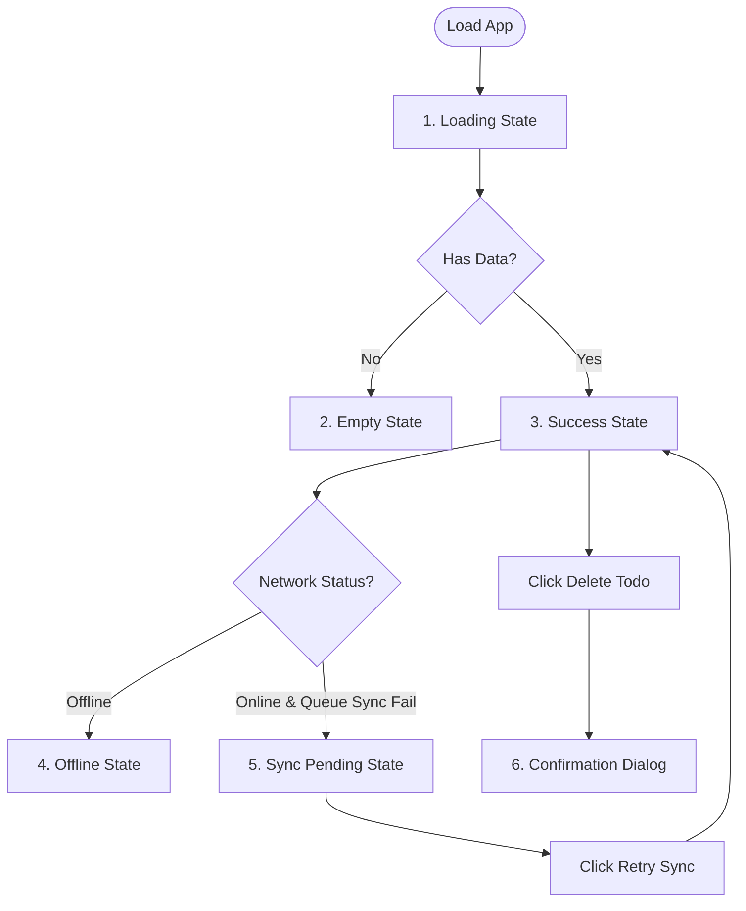

# Production UI States and Recovery Actions

This document outlines the **Production UI States and Recovery Actions** implemented in the Todo Management Application, representing the deliverables for **Hour 16**.

---

## 1. UI State Architecture

To ensure a robust user experience, the application implements distinct, production-ready visual states and recovery actions for different network and data conditions:



---

## 2. Implemented UI States

### 2.1. Loading State
* **When it occurs:** Triggered on app startup, when fetching initial cached todos, or during active session changes.
* **UI Representation:** A centered `CircularProgressIndicator()` is rendered inside the main content panel instead of the grid list:
  ```dart
  if (todoRepo.isLoading)
    const Center(child: CircularProgressIndicator())
  ```

### 2.2. Empty State
* **When it occurs:** Triggered when the user has zero tasks in their active workspace, or when the filter/search criteria yield no matching results.
* **UI Representation:** Renders the custom [EmptyState](file:///c:/Users/iniya/todo_app/lib/widgets/empty_state.dart) widget, showing a clean illustration, title, context message, and a call-to-action button.
  ```dart
  EmptyState(
    title: searchText.isEmpty ? 'You are all caught up!' : 'No tasks match search criteria',
    message: searchText.isEmpty ? 'Add a new task...' : 'Try refining your keywords...',
    action: () => showTodoForm(context, ref),
    actionLabel: 'Create Task',
  )
  ```

### 2.3. Error State
* **When it occurs:** Triggered when a database operation fails, RLS policies are violated, or connection errors arise.
* **UI Representation:** 
  * Displays an error banner in the main workspace [todo_dashboard.dart](file:///c:/Users/iniya/todo_app/lib/screens/todos/todo_dashboard.dart#L350) with warning icons.
  * Shows validation alerts on form text fields and registers error banners in the login/registration forms [auth_page.dart](file:///c:/Users/iniya/todo_app/lib/screens/auth/auth_page.dart#L205).

### 2.4. Success State (Workspace Grid)
* **When it occurs:** Triggered when tasks are loaded successfully.
* **UI Representation:** A clean grid system displaying list elements via [TodoCard](file:///c:/Users/iniya/todo_app/lib/widgets/todo_card.dart) widgets. Adapts to responsive sizing (switching to 2 columns on desktop, 1 column on mobile).

### 2.5. Offline State
* **When it occurs:** Triggered when the device network is cut off or the "Offline Mode Simulator" switch in Settings is toggled.
* **UI Representation:** A dark-grey status banner is shown at the top of the workspace (`Offline mode: Using local cache` or `Offline mode: N pending writes saved locally`). The app remains fully interactive, caching user actions.

### 2.6. Sync Pending State (Retry & Recovery)
* **When it occurs:** Triggered when the client is online but some database writes (inserts/updates/deletes) failed to replicate to the remote database.
* **UI Representation:** An orange warning banner appears indicating `N writes pending remote replication`.
* **Recovery Action:** Includes a **Retry (Sync) button** in the banner. Clicking it triggers the `synchronize()` replay engine to re-verify authentication credentials and push the queue:
  ```dart
  action = IconButton(
    icon: const Icon(Icons.sync),
    onPressed: () => repo.synchronize(),
  )
  ```

### 2.7. Confirmation Dialog
* **When it occurs:** Triggered when the user clicks the delete button (trash can) on a Todo item.
* **UI Representation:** Displays an alert dialog confirming deletion to prevent accidental data loss:
  ```dart
  void confirmDelete(BuildContext context, WidgetRef ref, Todo todo) {
    showDialog(
      context: context,
      builder: (context) => AlertDialog(
        title: const Text('Delete Todo?'),
        content: Text('Are you sure you want to delete "${todo.title}"?'),
        actions: [
          TextButton(onPressed: () => Navigator.pop(context), child: const Text('Cancel')),
          ElevatedButton(
            style: ElevatedButton.styleFrom(backgroundColor: Theme.of(context).colorScheme.error),
            onPressed: () {
              ref.read(todoRepositoryProvider).deleteTodo(todo.id);
              Navigator.pop(context);
            },
            child: const Text('Delete'),
          ),
        ]
      )
    );
  }
  ```
